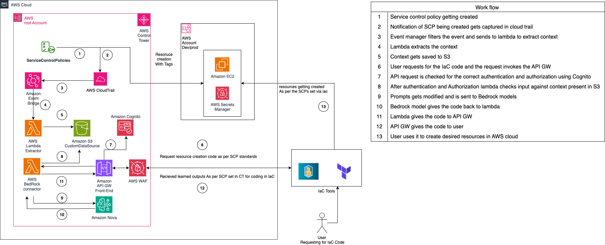
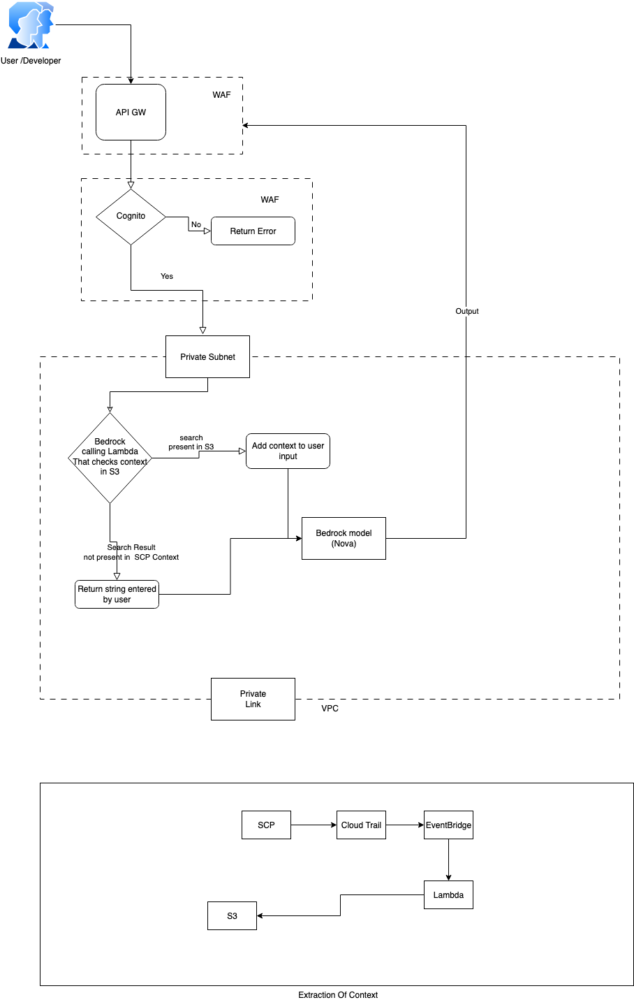

// Copyright Amazon.com, Inc. or its affiliates. All Rights Reserved.

// SPDX-License-Identifier: MIT-0

## Introduction

This solution introduces an intelligent Infrastructure as Code (IaC) generator powered by Amazon Bedrock Agents, designed to create and validate infrastructure code that complies with organizational Service Control Policies (SCPs). The solution leverages Amazon Bedrock Knowledge Bases to understand and interpret organizational SCPs, providing automated generation of compliant Terraform configurations. Through natural language interactions, users can request infrastructure configurations while the system ensures alignment with organizational policies, reducing the risk of non-compliant deployments and accelerating the infrastructure development process.

## Architecture


## Authentication / Authorization


## Pre-requisites
1. Install and use latest [Terraform CLI](https://developer.hashicorp.com/terraform/tutorials/aws-get-started/install-cli)
2. An AWS Control Tower Management account.
3. This solution has well defined user access policies and these policies could be changed as per organization requirement
4. AWS CLI V2 version
5. Please use the latest provider versions
6. A Amazon Bedrock Agent with security best practices
7. The models used in this solution are Amazon Nova. Please make sure that these are enabled in the account before deploying the code.
8. Cross check the region and the model access before deploying this.
9. A regulated VPC as per the best practices from the AWS Well Architected Framework with private subnets.
10. A KMS key with security best practices
11. Two S3 buckets (Lambda deployment and context storage)


## Software Requirements

| Name | Version |
|------|---------|
| <a name="requirement_aws"></a> [aws](#requirement\_aws) | ~> 5.69 |
| <a name="provider_archive"></a> [archive](#provider\_archive) | n/a |

## Deployment instructions

1. Clone this repository using below command 
```
git clone https://github.com/aws-samples/sample-for-ai-generated-iac-code-according-to-scp
```
2. Navigate into the project base directory
```
cd sample-for-ai-generated-iac-code-according-to-scp
```
3. Initialize terraform 
```
terraform init
```
4. Run terraform plan to view the list of all the resources that this solution with create.  
```
terraform plan
```
5. Follow the following steps to complete the pre deployment setup:

    1. Update terraform.tfvars

        * Fill in your VPC ID, private subnet ID, and route table ID
        * Specify existing S3 buckets for Lambda deployment and SCP context storage
        * Add your KMS key ARN for encryption

    2. Create .env file under tools folder

        * Configure cognito service with username and password
        * Set USER_POOL_ID, CLIENT_ID, API_URL for cognito_api_client.py in a separate .env file
        * Set USERNAME, PASSWORD, NEW_PASSWORD for user authentication
        * Required for testing API Gateway with Cognito authentication
        * tools/cognito_api_client.py could be used for verification of the access of API endpoint
    

    3. Update backend.tf

        * Configure S3 bucket for Terraform state storage
        
    4. Update locals.tf

        * Set Bedrock and context S3 regions if different from us-east-1

    5. Update variables.tf defaults

        * Customize region, environment name, and project name

        * Can change and Customize the default values of the other variables as well (optional)
        
    6. Update cognito-variables.tf

        * Set unique Cognito domain name and callback URLs

6. Run terraform apply. The flag --auto-approve is optional. If you don't use that, you will be prompted to enter a confirmation manually (Y/N)
```
terraform apply --auto-approve
```
7. For security the code has been implemented with default cognito service for user authorization and authentication
8. The terraform output shall reveal the urls that could be used for the first calls to API for getting the code as per SCP

## Security Considerations
1. Data at rest is encrypted by KMS key taken from the user as input
2. Logs are enabled for all components and is encrypted using KMS
3. Authentication and authorization is done using IAM roles and policy
4. WAF is set to block SQL injection and bad ip input, known bad input rule set and anonymous IP list 
5. All Lambda functions deployed in private subnets
6. Dedicated security group for Lambda functions with restricted access are created
7. VPC endpoints are created for private connectivity to AWS services without internet exposure
8. Cross-region replication in S3 enabled for disaster recovery and public access is blocked
9. Bedrock guardrails used to filter out harmful content from bedrock response
10. Terraform state backend is encrypted

## Security Recommendation
1. User Role to access the API gateway should have minimal required access rights
2. Consider using AWS identity center and user to get the AWS secret key, AWS seceret access key and token from AWS IDM page
3. Environment variable encryption can be used for enhanced security
4. Ensure automatic key rotation is enabled for KMS key used
5. Ensure least priviledge access is given for the KMS key policies 

## Known issues
Currently anti DDos rules can not be set due to bug in terraform which is addressed in Provider version 6.1.0. This version is not realeased as of 25th July 2025
[BugLink](https://github.com/hashicorp/terraform-provider-aws/blob/v6.1.0/CHANGELOG.md)

## Infrastructure cleanup
For the cleanup of the insfrastructure please follow below steps:
1. Empty the datsource S3 Bucket
2. Navigate into the project base directory
``` 
cd aws-scp-intelligent-iac-framework
```
3. The flag --auto-approve is optional. If you don't use that, you will be prompted to enter a confirmation manually (Y/N) 
terraform --destroy --auto-approve

## Resources

| Name | Type |
|------|------|
| [aws_api_gateway_deployment.deployment](https://registry.terraform.io/providers/hashicorp/aws/latest/docs/resources/api_gateway_deployment) | resource |
| [aws_api_gateway_integration.integration](https://registry.terraform.io/providers/hashicorp/aws/latest/docs/resources/api_gateway_integration) | resource |
| [aws_api_gateway_method.method](https://registry.terraform.io/providers/hashicorp/aws/latest/docs/resources/api_gateway_method) | resource |
| [aws_api_gateway_resource.resource](https://registry.terraform.io/providers/hashicorp/aws/latest/docs/resources/api_gateway_resource) | resource |
| [aws_api_gateway_rest_api.api](https://registry.terraform.io/providers/hashicorp/aws/latest/docs/resources/api_gateway_rest_api) | resource |
| [aws_cloudwatch_event_rule.console](https://registry.terraform.io/providers/hashicorp/aws/latest/docs/resources/cloudwatch_event_rule) | resource |
| [aws_cloudwatch_event_target.lambda](https://registry.terraform.io/providers/hashicorp/aws/latest/docs/resources/cloudwatch_event_target) | resource |
| [aws_lambda_function.log_tag_lambda](https://registry.terraform.io/providers/hashicorp/aws/latest/docs/resources/lambda_function) | resource |
| [aws_lambda_permission.allow_eventbridge_to_call](https://registry.terraform.io/providers/hashicorp/aws/latest/docs/resources/lambda_permission) | resource |
| [aws_lambda_permission.apigw_lambda](https://registry.terraform.io/providers/hashicorp/aws/latest/docs/resources/lambda_permission) | resource |
| [aws_ssm_parameter.ssm](https://registry.terraform.io/providers/hashicorp/aws/latest/docs/resources/ssm_parameter) | resource |
| [archive_file.python_lambda_package](https://registry.terraform.io/providers/hashicorp/archive/latest/docs/data-sources/file) | data source |
| [aws_caller_identity.current](https://registry.terraform.io/providers/hashicorp/aws/latest/docs/data-sources/caller_identity) | data source |

## Inputs

| Name | Description | Type | Default | Required |
|------|-------------|------|---------|:--------:|
| <a name="input_env"></a> [env](#input\_env) | Name of the environment, will be used as prefix in resources names | `string` | `"dev"` | no |
| <a name="input_project_name"></a> [project\_name](#input\_project\_name) | Name of the project, will be used as prefix in resources names | `string` | `"hackathon"` | no |
| <a name="input_region"></a> [region](#input\_region) | AWS Region | `string` | `"us-east-1"` | no |
| <a name="input_tags"></a> [tags](#input\_tags) | Tags for infrastructure resources. | `map` | <pre>{<br>  "test1": "value1",<br>  "test2": "value2"<br>}</pre> | no |

## Outputs

No outputs.
